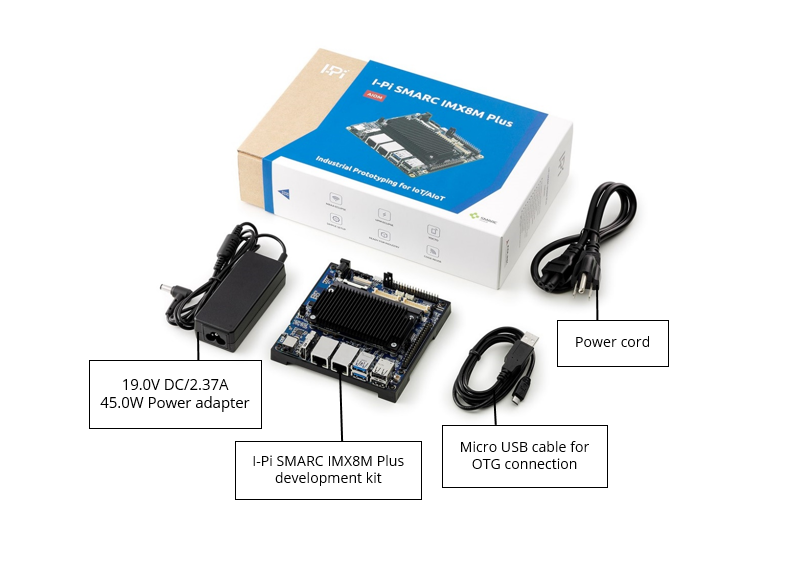

## What's inside the box

Before going to the setup or installation chapter please verify the contents of your package. Following items should be part of the kit. The standard set of Industrial Pi SMARC includes the following items:

1. I-Pi SMARC IMX8M Plus CoM pre-assembled in a chassis.
2. 19.0V DC /2.37A 45.0W Power adapter.
3. Micro USB cable for OTG connection.
4. Power cord.

 

**Watch our unboxing video to find more**:

<iframe
    width="100%"
    height="480"
    src="https://www.youtube.com/embed/NIFb8UUziEA"
    frameborder="0"
    allow="autoplay; encrypted-media"
    allowfullscreen
>
</iframe>

