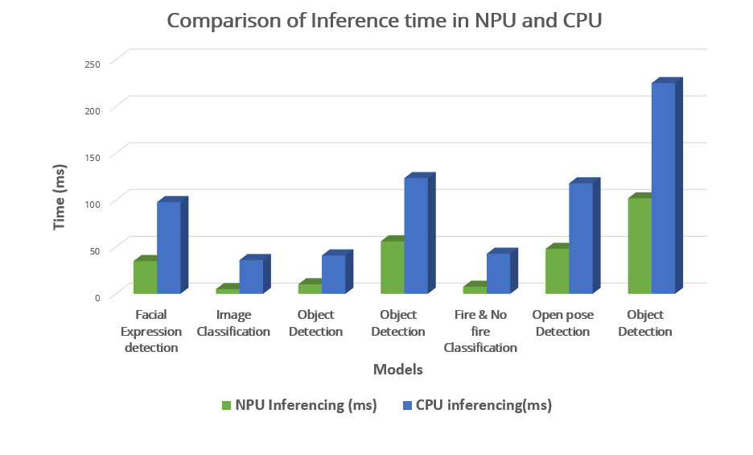

# eIQ ML software demo on NXP i.MX 8M Plus development kit

This demo demonstrates the use of eIQ, a machine learning software development environment from NXP that uses ML algorithms. The eIQ software is integrated into our I-Pi SMARC IMX8M Plus with yocto based linux image for interesting AI application.

### Prerequisites

#### Hardware Requirement

* I-Pi SMARC IMX8M Plus Development Kit
* Monitor, Keyboard and Mouse
* HDMI Display
* Ethernet

### Softwares Requirement
* Yocto flashed in eMMC

### What you will see ( AI demos)

### Object Detection 

Object detection is a computer vision and image processing technique that identifies objects such as people, buildings, or cars in images or videos. The object detection draws bounding boxes around these detected objects, which allows us to see where the identify things are in a given scene. Nowadays, Object detection is a handy application in video surveillance and image retrieval systems.

| Model       | Algorithm      | Inference Enigine | NPU Inferenceing (ms) | CPU Inferencing (ms)|
| --------------- |----------------------- |------------------------- |------------------------ |-------------------------- |
| Object Detection         | Single Shot detection (SSD)  | Tflite 2.3.0 | 10.25 |41 |
| Object Detection  | Deep Neural Network (DNN) | OpenCV 4.2.0      | 56 | 123.6 |
| Object Detection | YOLO v3 | Tflite 2.3.0 | 102 | 225 |

### Facial Expression Dectection

Facial emotion recognition is the process of detecting human emotions from facial expressions. It is difficult for us humans to recognize emotions in certain situations, and now,  facial expression detection applications have been developed to help people with emotion recognition. This technology is becoming more accurate and will eventually be able to read emotions as well as our brains do or even better. 

| Model                       | Algorithm | Inference Enigine | NPU Inferenceing (ms) | CPU Inferencing (ms) |
| --------------------------- | --------- | ----------------- | --------------------- | -------------------- |
| Facial Expression Detection | MobileNet | Tflite 2.3.0      | 35                    | 98                   |

### Image classification

Image classification refers to identifying objects and classifying them into categories based on the basic training set of data containing observation with the known class.

| Model                | Algorithm | Inference Enigine | NPU Inferenceing (ms) | CPU Inferencing (ms) |
| -------------------- | --------- | ----------------- | --------------------- | -------------------- |
| Image classification | MobileNet | Tflite 2.3.0      | 5                     | 36                   |

### Fire & No Fire Classification

Fire classification and detection are designed to detect fires in Images or videos. This application has recently played a crucial role in reducing fire losses by alarming users early through early fire detection. These detections ( Fire and no Fire detection) are conducted with the use of complex algorithms.

| Model                         | Algorithm                        | Inference Enigine | NPU Inferenceing (ms) | CPU Inferencing (ms) |
| ----------------------------- | -------------------------------- | ----------------- | --------------------- | -------------------- |
| Fire & No Fire Classification | Convolution Neural Network (CNN) | ArmNN             | 7.6                   | 42.8                 |

### OpenPose Detection

The pose is a computer vision task that identifies a person’s pose in an image or video. We can also think of pose estimation as the problem of determining the position and orientation of a camera relative to a given person. This is typically done by identifying, locating, and tracking the number of key points on a given object or person. For things, this could be corners or other significant features. And for humans, these key points represent major joints like an elbow, hand, neck, or knee.

| Model              | Algorithm | Inference Enigine | NPU Inferenceing (ms) | CPU Inferencing (ms) |
| ------------------ | --------- | ----------------- | --------------------- | -------------------- |
| OpenPose Detection | MobileNet | Tflite 2.3.0      | 48                    | 118                  |

