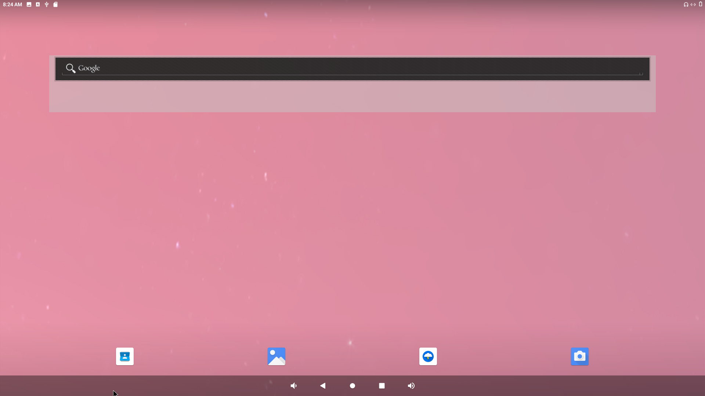
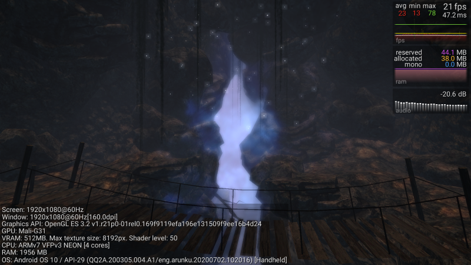

title: Android Images
---

 

## Android 10

### Binary Image download Link

* Android 10 32bit (file size of the compressed image: 463 MB): [click here](https://hq0epm0west0us0storage.blob.core.windows.net/public/SMARC/LEC-PX30/Images/Android/LEC-PX30-IPI-SMARC_Android10_sdcard_2v6_20200916.zip)

* Android 10 64bit: (file size of the compressed image: 599 MB) [click here](https://hq0epm0west0us0storage.blob.core.windows.net/$web/public/SMARC/LEC-PX30/Images/Android/LEC-PX30-IPI-SMARC_Android10_64bit_sdcard_2v8_20201221.zip)

  **Note**:

  1. Please find  [here](HowToFlashImage.html#To-Flash-the-Yocto-Android-Image) a description how to flash an image to the SD card
  2. Note that the SMARC boot device selector on the carrier does not work in conjunction with LEC-PX30 due to the design of [PX30 SOC boot order](PX30BootFlow.html)

 

Boot up the system from the SD card, once booted you will see the following screen:

### Android supported features & interfaces 

* Linux kernel version 4.19
* Support H.265, H.264, MPEG-4, VP8, and VC-1 video codec with up to 1080p60fps
* 2D / 3D Graphics Acceleration [with Arm Mali-G31 GPU](https://developer.arm.com/ip-products/graphics-and-multimedia/mali-gpus/mali-g31-gpu) 
* 4x USB 2.0 ports
* 2x 10/100 Mb LAN ports 
* HDMI output with resolution 1920x1080@60Hz
* Analog to Digital input interface (ADS1115) 
* Audio & speaker (Realtek ALC5640 Codec)
* USB OTG support ADB Shell
* CAN FD Bus interface
* [40 Pin expansion header](UserInterfaces.html) with UART, I2C, SPI, GPIO and PWM support 
* [MicroG ](https://microg.org/) service support: Providing the functionality required to run apps that use Google Play Services.
* Raspberry Pi Camera V2.1 (2 Lanes) - SONY iMX219 sensor ([Datasheet](https://www.raspberrypi.org/documentation/hardware/camera/))  
* WIFI/BT USB Dongle ([EW-7611ULB datasheet](https://www.edimax.com/edimax/mw/cufiles/files/download/datasheet/EW-7611ULB_datasheet_English.pdf))

 

 

**3D benchmark**

