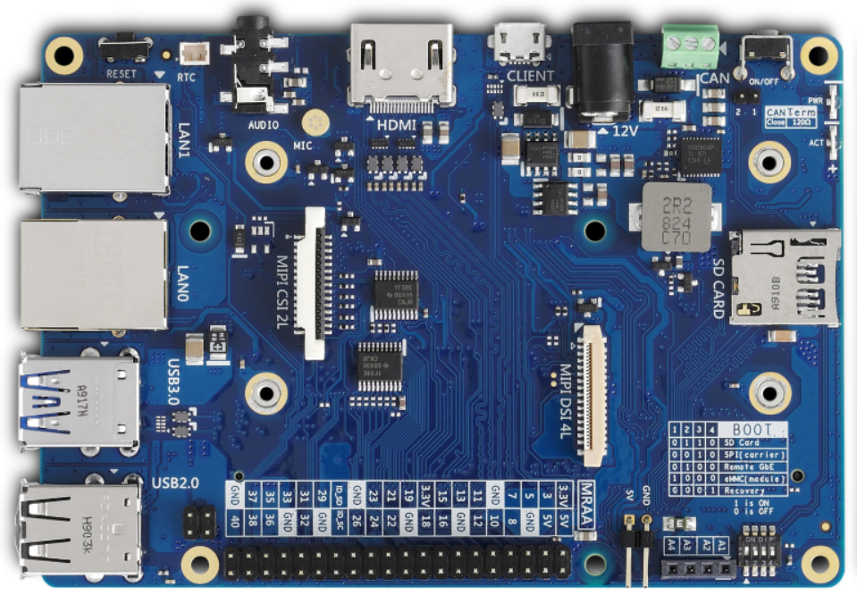
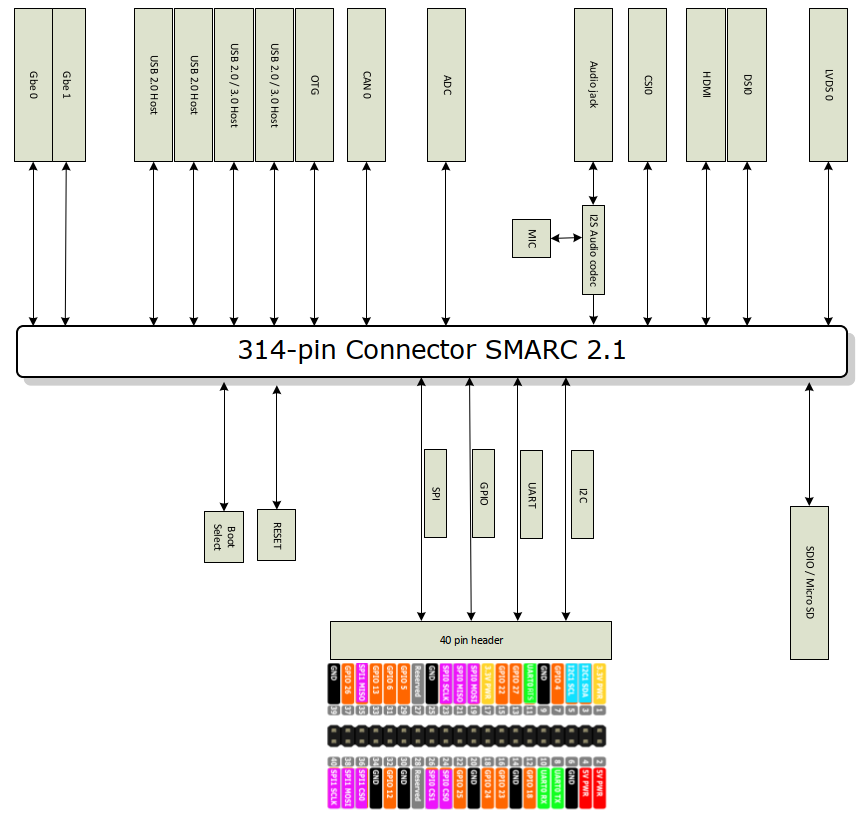

title: Carrier Board Introduction 
---

#  I-Pi-SMARC with SMARC 2.1 Small Form Carrier Board

 

### **Features**

*  SMARC revision 2.1 compliant

* LVDS, DSI and HDMI graphic output interfaces 

* Dual GbE ports and USB 2.0 / USB 3.0 interfaces

* I2S audio codec interface

* 40-pin MRAA compliant signal header 

* Rugged operating temperature (option): -40°C to +85°C

* 10 year product availability

   

### **Specifications**

####  **Video**

  * 1x HDMI 1.4b / 2.0b
  * 1x MIPI-DSI 4 lanes 
  * 1x MIPI-CSI dual lane interface 

####  **I2S audio codec**

####  **Dual Ethernet**

  * Primary LAN:  1x 10/100/1000 RJ45 connector
  * Secondary LAN: 1x 10/100/1000 RJ45 connector

#### **Expansion Busses**

  * 2x USB 3.0, 2x USB 2.0, 1x USB 2.0 OTG connectors
  * 2x UART interfaces SER2 (CTS/RTS) and SER0 (CTS/RTS)
  * 1x CAN 2 interface pin headers
  * 2x SPI pin headers
  * 1x I²S interface to audio interface
  * 2x I²C interface on pin header
  * 14x GPIO with interrupt on pin header

#### **Storage**

  * 1x SDIO (4-bit) compatible with SD/SDIO standard, up to version 3.0

####  **Power**

  * 12Vdc input via barrel connector

####  **Mechanical and Environmental**

  * Form Factor: SGET SMARC Specifications 2.1

  * Dimensions: 116 mm x 81 mm

  * Operating Temperature: 

    * Standard: 0°C to +60°C 
    * Rugged: -40°C to +85°C (optional)

  * Humidity: 

    * 5-90% RH operating, non-condensing 
    * 5-95% RH storage (and operating with conformal coating)

  * Shock and Vibration

    * IEC 60068-2-64 and IEC-60068-2-27, MIL-STD-202 F, 
      Method 213B, Table 213-I, Condition A and Method 214A, 
      Table 214-I, Condition D

  * HALT

    * Thermal Stress, Vibration Stress, Thermal Shock and Combined Test

       

### **Block Diagram**

